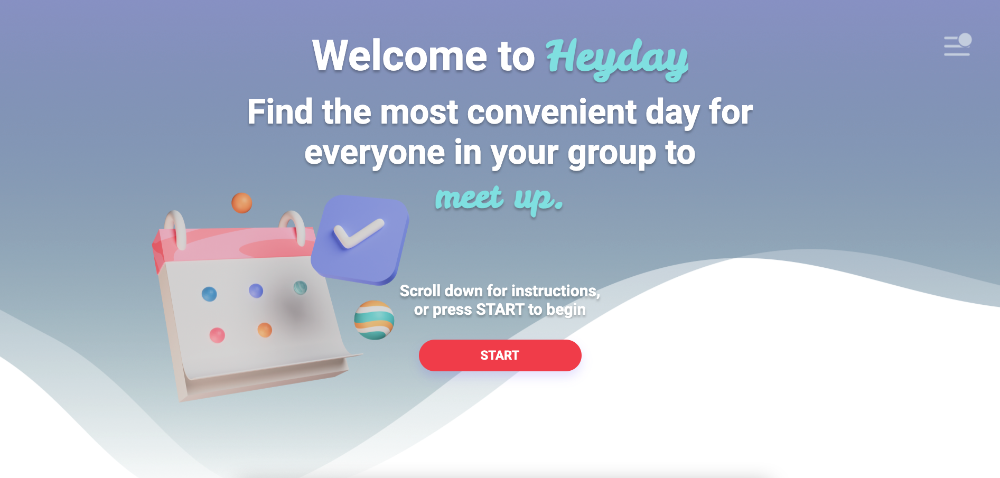
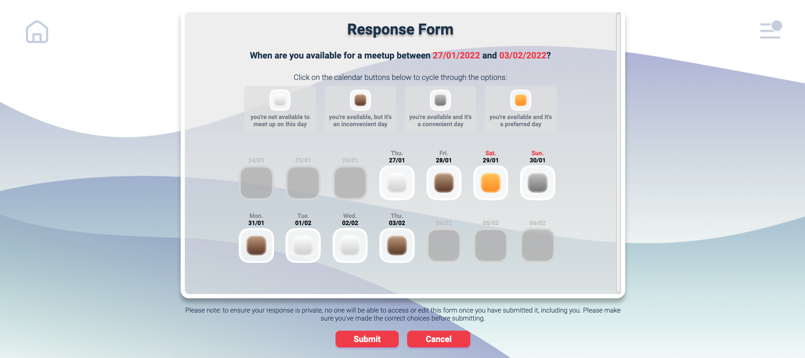
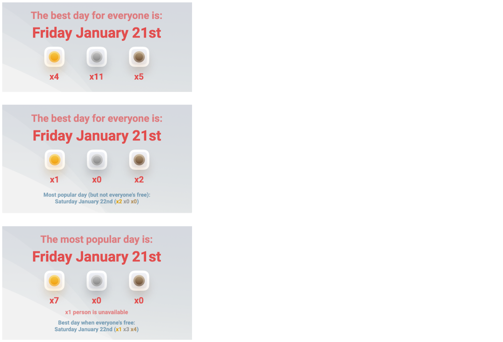

### Introduction

**Heyday aims to empower a group of users to find a day to meet up, resolving different availabilities and preferences while emphasising ease-of-access and user privacy.**

Our dev team created this app with four key features in mind:

1. **Ease to access.** Heyday is easy to use and doesn't require **any** login details, which we felt could be a barrier to uptake for some users
2. **Privacy.** To give users confidence in Heyday, we don't store any personal information (e.g. login details or an email address). We also keep users' availability private from other users, so those who value the privacy of their calendar can safely use this web-app
3. **Convenience.** Heyday captures not just availability, but also convenience and preference for certain days. All three of these are factored into our algorithm for the final result
4. **No decision making.** Heyday makes the final decision on what the best day for a meet up is, so no user decision-making is required.

Ultimately, we believe Heyday is the best means for a group to find the most convenient day for everyone to meet up.



This project was bootstrapped with [Create React App](https://github.com/facebook/create-react-app).

### Access

Heyday is hosted on Vercel and can be accessed [here](https://heyday.vercel.app/).

### Instructions

Heyday's instructions can be found on the landing page. They are also summarised here:

1. Click the Start button on the landing page to begin. This will take you to the Setup page
2. On the Setup page, specify a date-range and a group size for a meet up. Click submit to create a Room and be taken to your Room page
3. On your Room page, open a Response Form and submit 1) when you're free and 2) what your preferences are
4. Share the Room link with the rest of your group (e.g. via email or Whatsapp) and ask them all to complete a Response Form
5. Once all response forms are submitted, Heyday will calculate the best for everyone, and this will be displayed in the Room. Users can then supply their email address (which is not stored) to receive a copy of the results

To capture availability, convenience and preference, Heyday's Response Forms allow users to specify when they're free using a rating scale: white (you're not available to meet up on this day), bronze (you're available, but it's an inconvenient day), silver (you're available and it's a convenient day) and gold (you're available and it's a preferred day).



These ratings are used to calculate the best day for everyone. It produces two results: the "most popular day" (i.e. the day with the highest rating), and the "best for everyone" day (i.e. the highest rated day when everyone's available). For larger groups, our algorithm favours the "most popular day", and will therefore exclude people if a particularly popular days arises that not everyone can attend. For smaller groups, the algorithm favours the "best for everyone" day, prioritising full attendance. This means the results display can vary depending on group size and input.



- [React Router](https://reactrouter.com/)
- [React Testing Library](https://testing-library.com/)
- [Express](https://expressjs.com/)
- [Sass](https://sass-lang.com/)

We selected these technologies to gain additional JavaScript and React knowledge prior to finishing the Maker's
Bootcamp. Sass was used to enhance features of CSS styling.

---

## Running Heyday

information to go here based on where project is hosted

---

If you are interested in trying your own React App, please click [here](#installation--creating-an-app) to find
information about doing so. Additionally, you can click [here](#available-scripts) to see scripts that can be run if
you have cloned or forked this repo.

# Contributors

- [Matt Zimmer](https://github.com/Zimmja)
- [Myoung Bae](https://github.com/mhbae-dev)
- [Andrew Bird](https://github.com/AndyBird88)
- [Ryan Grimes](https://github.com/RPGrimes)
- [Courtney Stow](https://github.com/Court534)
- [Ginny Thomas](https://github.com/ginnyamazed)

### License

[GPL-3.0](https://choosealicense.com/licenses/gpl-3.0/)

## Available Scripts

If you have our project on your local device the following are ome of the available scripts.

In the project directory, you can run:

### `npm start`

Runs the app in the development mode.\
Open [http://localhost:3000](http://localhost:3000) to view it in your browser.

The page will reload when you make changes.\
You may also see any lint errors in the console.

### `npm test`

Launches the test runner in the interactive watch mode.\
See the section about [running tests](https://facebook.github.io/create-react-app/docs/running-tests) for more information.

### `npm run build`

Builds the app for production to the `build` folder.\
It correctly bundles React in production mode and optimizes the build for the best performance.

The build is minified and the filenames include the hashes.\
Your app is ready to be deployed!

See the section about [deployment](https://facebook.github.io/create-react-app/docs/deployment) for more information.

### Installation / Creating an App

To duplicate starting a new project with the same technology we used:

Open Terminal and go to the desired pre-project directory.

You’ll need to have Node 14.0.0 or later version on your local development machine

```
npx create-react-app my-app
cd my-app
```

```
npm install

```
